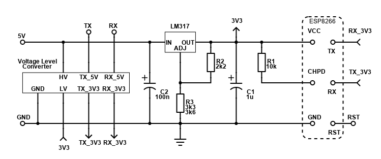

Library to communicate with generic ESP8266 via serial using AT commands. It is based on SoftwareSerial library.


```cpp
#define RX_PIN  4  // Connect this pin to TX on the esp8266
#define TX_PIN  6  // Connect this pin to RX on the esp8266
#define RST_PIN 5

#define SSID "ssid1234"
#define PASS "pass1234"
#define PORT "80"

ESP8266_HTTP server(RX_PIN, TX_PIN, RST_PIN);

void setup() {
    Serial.begin(9600);
    while (!Serial);
    Serial.println("Start!");

    if (server.start(SSID, PASS, PORT) == 0) {
        Serial.print("Server is running on ");
        Serial.print(server.getIP());
        Serial.print(":");
        Serial.println(PORT);

        // Every Route has unique ID - it is given by the sequence of registration
        server.registerRoute(HTTP_Method::GET, "/");     // ID == 1
        server.registerRoute(HTTP_Method::GET, "/test"); // ID == 2
    }
}

void loop() {
    code = server.update();
    switch(code) {
        case 4: // Something was received
            Serial.println("Unexpected Message from ESP8266!");
            break;
        case 3: // TCP Message
            Serial.println("New Message!");
            route = server.preprocessRequest();
            processRequest(route);
            break;
        case 2: // Client disconnected
            Serial.println("Disconnected!");
            break;
        case 1: // Client connected
            Serial.println("Connected!");
            break;
        case 0: // Nothing happened
        default:
            break;
    }

    // Rest of Arduino code
    // Must be fast code
}

void processRequest(Route * route) {
    if (route != NULL) {
        // Valid HTTP request
        // Here process request
        // getID() to decide which part of code to execute
    }
}
```

# ESP8266_HTTP
High level class ESP8266_HTTP enables user to manage HTTP requests. 

When Route is not registered, then in a case of incoming HTTP request method preprocessRequest() automatically responds with 404 NOT FOUND and returns NULL pointer.

# ESP8266_WLAN
Responsible for managing communication between ESP8266 and Arduino based on AT commands. Every received message is decoded, processed and stored in BUFFER.

Make sure method update() is called every loop cycle to check serial for any incoming messages.
```cpp
/**
 * 0 : Nothing happened
 * 1 : Client connected
 * 2 : Client disconnected
 * 3 : TCP message
 * 4 : Response to AT request (e. g. AT+CIPSTATUS, etc.)
 */
byte ESP8266_WLAN::update();
```
It is forbidden to send requests to ESP8266 in the loop() like "AT+CIPSTATUS" because there may be different message than the response to that AT command. You see, ESP8266 can also behave as a Master, when client connects or client disconnects or TCP message arrives.

In order to send a message to ESP8266, use method send(), or send_PROGMEM() when the string literal is stored in Flash memory (recommended).
```cpp
/**
 * @brief Sends message. Function assumes the channel is connected!
 * @param channel Channel to which the message should be sent.
 * @param message End every line with
 * @param eol End Of Line flag
 * @param sendNow false - message is saved only to the BUFFER.
 * @return true when success.
 */
bool ESP8266_WLAN::send(char channel, const char * message, bool eol, bool sendNow);

/**
 * @brief Message is loaded from Flash (PROGMEM). MUST END WITH \r\n !!!
 * @param channel Channel to which the message should be sent.
 * @param message End every line with
 */
bool ESP8266_WLAN::send_PROGMEM(char channel, const char * message);
```

ESP8266 AT commands reference:
* https://github.com/espressif/esp8266_at/wiki
* https://www.espressif.com/sites/default/files/documentation/4a-esp8266_at_instruction_set_en.pdf
* https://www.itead.cc/wiki/images/5/53/Esp8266_at_instruction_set_en_v1.5.4_0.pdf

# Constants
Make sure the following constants suit your application.

| Constant           | Default Value | Description |
|:------------------ |:-------------:|:----------- |
| MAX_ROUTES         | 3             | Defines how many routes are possible to register. Bigger application would certainly require more than 3. |
| MAX_BUFFER_SIZE*   | 512           | Defines the size of the BUFFER where all messages are saved. Typical HTTP request has around 350 bytes. |
| MAX_CONNECTIONS    | 3             | Defines how many clients can be connected at the same time. (Number of independent channels.) |
| MAX_RESET_ATTEMPTS | 3             | For now not used. |
\* Arduino Nano and Uno have only 2048 bytes of RAM. It is possible to increase MAX_BUFFER_SIZE but make sure the Global variable size is around 70%-80% at max.
# Schematic



